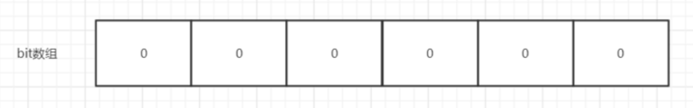
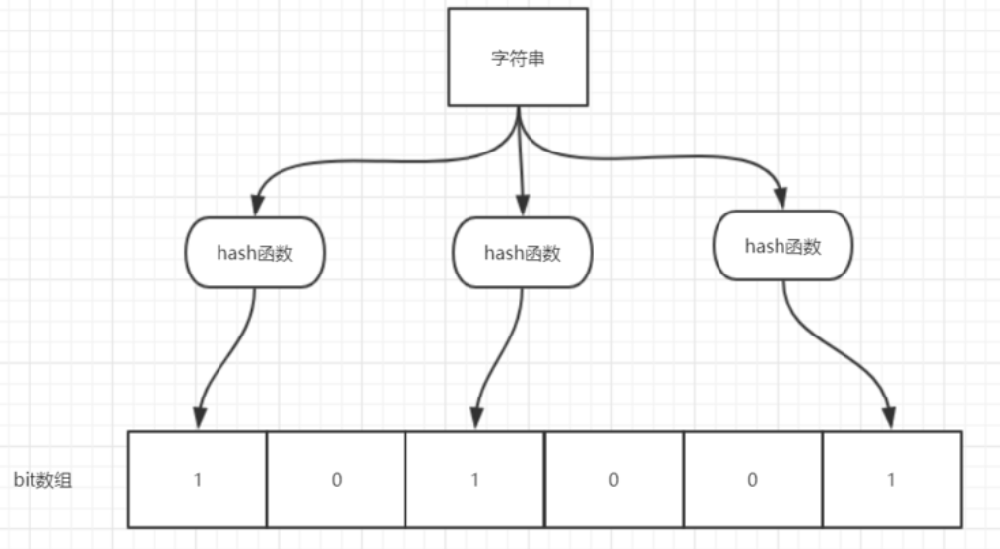

# 布隆过滤器

## 什么是布隆过滤器？

布隆过滤器（Bloom Filter）是一个叫做 Bloom 的老哥于 1970 年提出的。我们可以把它看作由二进制向量（或者说位数组）和一系列随机映射函数（哈希函数）两部分组成的数据结构。相比于我们平时常用的的 List、Map 、Set 等数据结构，它占用空间更少并且效率更高，但是缺点是其返回的结果是概率性的，而不是非常准确的。理论情况下添加到集合中的元素越多，误报的可能性就越大。并且，存放在布隆过滤器的数据不容易删除。





位数组中的每个元素都只占用 1 bit ，并且每个元素只能是 0 或者 1。这样申请一个 100w 个元素的位数组只占用 1000000Bit / 8 = 125000 Byte = 125000/1024 kb ≈ 122kb 的空间。

总结：**一个名叫 Bloom 的人提出了一种来检索元素是否在给定大集合中的数据结构，这种数据结构是高效且性能很好的，但缺点是具有一定的错误识别率和删除难度。并且，理论情况下，添加到集合中的元素越多，误报的可能性就越大。**


## 原理介绍

**当一个元素加入布隆过滤器中的时候，会进行如下操作：**

1. 使用布隆过滤器中的哈希函数对元素值进行计算，得到哈希值（有几个哈希函数得到几个哈希值）。
2. 根据得到的哈希值，在位数组中把对应下标的值置为 1。


**当我们需要判断一个元素是否存在于布隆过滤器的时候，会进行如下操作：**

1. 对给定元素再次进行相同的哈希计算；
2. 得到值之后判断位数组中的每个元素是否都为 1，如果值都为 1，那么说明这个值在布隆过滤器中，如果存在一个值不为 1，说明该元素不在布隆过滤器中。





当字符串存储要加入到布隆过滤器中时，该字符串首先由多个哈希函数生成不同的哈希值，然后将对应的位数组的下标设置为 1（当位数组初始化时，所有位置均为 0）。当第二次存储相同字符串时，因为先前的对应位置已设置为 1，所以很容易知道此值已经存在（去重非常方便）。

如果我们需要判断某个字符串是否在布隆过滤器中时，只需要对给定字符串再次进行相同的哈希计算，得到值之后判断位数组中的每个元素是否都为 1，如果值都为 1，那么说明这个值在布隆过滤器中，如果存在一个值不为 1，说明该元素不在布隆过滤器中。

**不同的字符串可能哈希出来的位置相同，这种情况我们可以适当增加位数组大小或者调整我们的哈希函数。**

综上，我们可以得出：**布隆过滤器说某个元素存在，小概率会误判。布隆过滤器说某个元素不在，那么这个元素一定不在。**


## 布隆过滤器使用场景

1. 判断给定数据是否存在：比如判断一个数字是否存在于包含大量数字的数字集中（数字集很大，5 亿以上！）、 防止缓存穿透（判断请求的数据是否有效避免直接绕过缓存请求数据库）等等、邮箱的垃圾邮件过滤、黑名单功能等等。
2. 去重：比如爬给定网址的时候对已经爬取过的 URL 去重。


## Guava 布隆过滤器

引入 Guava 的依赖：

```xml
        <dependency>
            <groupId>com.google.guava</groupId>
            <artifactId>guava</artifactId>
            <version>28.0-jre</version>
        </dependency>
```


```java
package mao;

import com.google.common.hash.BloomFilter;
import com.google.common.hash.Funnels;

/**
 * Project name(项目名称)：布隆过滤器
 * Package(包名): mao
 * Class(类名): GuavaBloomFilter
 * Author(作者）: mao
 * Author QQ：1296193245
 * GitHub：https://github.com/maomao124/
 * Date(创建日期)： 2023/2/27
 * Time(创建时间)： 20:01
 * Version(版本): 1.0
 * Description(描述)： 无
 */

public class GuavaBloomFilter
{
    public static void main(String[] args)
    {
        //布隆过滤器对象，创建最多存放最多2000个整数的布隆过滤器，误判率为0.01
        BloomFilter<Integer> bloomFilter = BloomFilter.create(
                Funnels.integerFunnel(), 2000, 0.01);

        //判断是否存在
        System.out.println(bloomFilter.mightContain(100));
        System.out.println(bloomFilter.mightContain(101));
        System.out.println(bloomFilter.mightContain(102));

        //设置值
        bloomFilter.put(100);
        bloomFilter.put(101);
        bloomFilter.put(102);

        //判断是否存在
        System.out.println(bloomFilter.mightContain(100));
        System.out.println(bloomFilter.mightContain(101));
        System.out.println(bloomFilter.mightContain(102));
        System.out.println(bloomFilter.mightContain(103));
    }
}
```


运行结果：

```sh
false
false
false
true
true
true
false
```


```java
package mao;

import com.google.common.hash.BloomFilter;
import com.google.common.hash.Funnels;

/**
 * Project name(项目名称)：布隆过滤器
 * Package(包名): mao
 * Class(类名): GuavaBloomFilter2
 * Author(作者）: mao
 * Author QQ：1296193245
 * GitHub：https://github.com/maomao124/
 * Date(创建日期)： 2023/2/27
 * Time(创建时间)： 20:12
 * Version(版本): 1.0
 * Description(描述)： 测试布隆过滤器误差
 */

public class GuavaBloomFilter2
{
    public static void main(String[] args)
    {
        testGuavaBloomFilter(10000, 0.01);
        testGuavaBloomFilter(10000, 0.02);
        testGuavaBloomFilter(10000, 0.05);
        testGuavaBloomFilter(10000, 0.1);
        testGuavaBloomFilter(10000, 0.5);

        System.out.println("------");
        testGuavaBloomFilter(3000, 0.01);
        testGuavaBloomFilter(3000, 0.02);
        testGuavaBloomFilter(3000, 0.05);
        testGuavaBloomFilter(3000, 0.1);
        testGuavaBloomFilter(3000, 0.5);

        System.out.println("------");
        testGuavaBloomFilter(2000, 0.01);
        testGuavaBloomFilter(2000, 0.02);
        testGuavaBloomFilter(2000, 0.05);
        testGuavaBloomFilter(2000, 0.1);
        testGuavaBloomFilter(2000, 0.5);

        System.out.println("------");
        testGuavaBloomFilter(1000, 0.01);
        testGuavaBloomFilter(1000, 0.02);
        testGuavaBloomFilter(1000, 0.05);
        testGuavaBloomFilter(1000, 0.1);
        testGuavaBloomFilter(1000, 0.5);
        testGuavaBloomFilter(1000, 0.005);
        testGuavaBloomFilter(1000, 0.001);
        testGuavaBloomFilter(1000, 0.0001);

        System.out.println("------");
        testGuavaBloomFilter(500, 0.01);
        testGuavaBloomFilter(500, 0.02);
        testGuavaBloomFilter(500, 0.05);
        testGuavaBloomFilter(500, 0.1);
        testGuavaBloomFilter(500, 0.5);
        testGuavaBloomFilter(500, 0.005);
        testGuavaBloomFilter(500, 0.001);
        testGuavaBloomFilter(500, 0.0001);

        System.out.println("------");
        testGuavaBloomFilter(200, 0.01);
        testGuavaBloomFilter(200, 0.02);
        testGuavaBloomFilter(200, 0.05);
        testGuavaBloomFilter(200, 0.1);
        testGuavaBloomFilter(200, 0.5);
        testGuavaBloomFilter(200, 0.005);
        testGuavaBloomFilter(200, 0.001);
        testGuavaBloomFilter(200, 0.0001);

        System.out.println("------");
        testGuavaBloomFilter(100, 0.01);
        testGuavaBloomFilter(100, 0.02);
        testGuavaBloomFilter(100, 0.05);
        testGuavaBloomFilter(100, 0.1);
        testGuavaBloomFilter(100, 0.5);
        testGuavaBloomFilter(100, 0.005);
        testGuavaBloomFilter(100, 0.001);
        testGuavaBloomFilter(100, 0.0001);
    }


    /**
     * 测试Guava的布隆过滤器
     *
     * @param expectedInsertions 布隆过滤器最多存放的数量
     * @param fpp                误差
     */
    public static void testGuavaBloomFilter(int expectedInsertions, double fpp)
    {
        //布隆过滤器对象，创建最多存放最多2000个整数的布隆过滤器，误判率为0.01
        BloomFilter<Integer> bloomFilter = BloomFilter.create(
                Funnels.integerFunnel(), expectedInsertions, fpp);

        //1500次循环
        for (int i = 0; i < 1500; i++)
        {
            if (i % 3 == 0)
            {
                continue;
            }
            //将i的值% 3 不等于 0 的值放进去
            bloomFilter.put(i);
        }

        //存在的计数
        int count = 0;
        //统计
        for (int i = 0; i < 1500; i++)
        {
            //判断是否存在
            boolean b = bloomFilter.mightContain(i);
            //System.out.println(i + " --> " + b);
            //可能存在
            if (b)
            {
                count++;
            }
        }
        System.out.println("最大数量：" + expectedInsertions + "  误差：" + fpp);
        System.out.println("预期结果：1000，最终结果：" + count);
        System.out.println();
    }
}
```


运行结果：

```sh
最大数量：10000  误差：0.01
预期结果：1000，最终结果：1000

最大数量：10000  误差：0.02
预期结果：1000，最终结果：1000

最大数量：10000  误差：0.05
预期结果：1000，最终结果：1000

最大数量：10000  误差：0.1
预期结果：1000，最终结果：1000

最大数量：10000  误差：0.5
预期结果：1000，最终结果：1030

------
最大数量：3000  误差：0.01
预期结果：1000，最终结果：1000

最大数量：3000  误差：0.02
预期结果：1000，最终结果：1000

最大数量：3000  误差：0.05
预期结果：1000，最终结果：1001

最大数量：3000  误差：0.1
预期结果：1000，最终结果：1001

最大数量：3000  误差：0.5
预期结果：1000，最终结果：1095

------
最大数量：2000  误差：0.01
预期结果：1000，最终结果：1000

最大数量：2000  误差：0.02
预期结果：1000，最终结果：1000

最大数量：2000  误差：0.05
预期结果：1000，最终结果：1002

最大数量：2000  误差：0.1
预期结果：1000，最终结果：1013

最大数量：2000  误差：0.5
预期结果：1000，最终结果：1137

------
最大数量：1000  误差：0.01
预期结果：1000，最终结果：1006

最大数量：1000  误差：0.02
预期结果：1000，最终结果：1011

最大数量：1000  误差：0.05
预期结果：1000，最终结果：1021

最大数量：1000  误差：0.1
预期结果：1000，最终结果：1053

最大数量：1000  误差：0.5
预期结果：1000，最终结果：1230

最大数量：1000  误差：0.005
预期结果：1000，最终结果：1000

最大数量：1000  误差：0.001
预期结果：1000，最终结果：1001

最大数量：1000  误差：1.0E-4
预期结果：1000，最终结果：1000

------
最大数量：500  误差：0.01
预期结果：1000，最终结果：1075

最大数量：500  误差：0.02
预期结果：1000，最终结果：1106

最大数量：500  误差：0.05
预期结果：1000，最终结果：1128

最大数量：500  误差：0.1
预期结果：1000，最终结果：1175

最大数量：500  误差：0.5
预期结果：1000，最终结果：1375

最大数量：500  误差：0.005
预期结果：1000，最终结果：1060

最大数量：500  误差：0.001
预期结果：1000，最终结果：1037

最大数量：500  误差：1.0E-4
预期结果：1000，最终结果：1011

------
最大数量：200  误差：0.01
预期结果：1000，最终结果：1423

最大数量：200  误差：0.02
预期结果：1000，最终结果：1438

最大数量：200  误差：0.05
预期结果：1000，最终结果：1421

最大数量：200  误差：0.1
预期结果：1000，最终结果：1442

最大数量：200  误差：0.5
预期结果：1000，最终结果：1479

最大数量：200  误差：0.005
预期结果：1000，最终结果：1399

最大数量：200  误差：0.001
预期结果：1000，最终结果：1375

最大数量：200  误差：1.0E-4
预期结果：1000，最终结果：1293

------
最大数量：100  误差：0.01
预期结果：1000，最终结果：1497

最大数量：100  误差：0.02
预期结果：1000，最终结果：1500

最大数量：100  误差：0.05
预期结果：1000，最终结果：1497

最大数量：100  误差：0.1
预期结果：1000，最终结果：1497

最大数量：100  误差：0.5
预期结果：1000，最终结果：1494

最大数量：100  误差：0.005
预期结果：1000，最终结果：1498

最大数量：100  误差：0.001
预期结果：1000，最终结果：1498

最大数量：100  误差：1.0E-4
预期结果：1000，最终结果：1481
```


当 `mightContain()` 方法返回 _true_ 时，我们可以 99％确定该元素在过滤器中，当过滤器返回 _false_ 时，我们可以 100％确定该元素不存在于过滤器中。

**Guava 提供的布隆过滤器的实现还是很不错的，但是它有一个重大的缺陷就是只能单机使用（另外，容量扩展也不容易），而现在互联网一般都是分布式的场景。为了解决这个问题，我们就需要用到 Redis 中的布隆过滤器了。**


## Redis 中的布隆过滤器

### 介绍

Redis v4.0 之后有了 Module（模块/插件） 功能，Redis Modules 让 Redis 可以使用外部模块扩展其功能 。布隆过滤器就是其中的 Module。

https://redis.io/resources/modules/


另外，官网推荐了一个 RedisBloom 作为 Redis 布隆过滤器的 Module，地址：https://github.com/RedisBloom/RedisBloom 
其他还有：

* redis-lua-scaling-bloom-filter（lua 脚本实现）：https://github.com/erikdubbelboer/redis-lua-scaling-bloom-filter
* pyreBloom（Python 中的快速 Redis 布隆过滤器） ：https://github.com/seomoz/pyreBloom


### 使用 Docker 安装

库：[redislabs/rebloom - Docker Image | Docker Hub](https://hub.docker.com/r/redislabs/rebloom/)


#### 第一步：搜索

命令：**docker search redislabs/rebloom**


```sh
PS C:\Users\mao\Desktop> docker search redislabs/rebloom
NAME                DESCRIPTION                                 STARS     OFFICIAL   AUTOMATED
redislabs/rebloom   A probablistic datatypes module for Redis   22                   [OK]
PS C:\Users\mao\Desktop>
```


#### 第二步：拉取镜像

命令：**docker pull redislabs/rebloom**


```sh
PS C:\Users\mao\Desktop> docker pull redislabs/rebloom
Using default tag: latest
latest: Pulling from redislabs/rebloom
284055322776: Pull complete
b7286e96019c: Pull complete
8d789d3c47a4: Pull complete
3806fdc99c73: Pull complete
e751a0826f38: Pull complete
ef5499a774c1: Pull complete
c72d4acf12b3: Pull complete
38d98e95a943: Pull complete
4a50810bd519: Pull complete
209cee60b260: Pull complete
605e8f893c4b: Pull complete
Digest: sha256:182ba5c55c8b2b5758edda4682f8f7a3711efe025d593583ecf1bf3ed9b4f55e
Status: Downloaded newer image for redislabs/rebloom:latest
docker.io/redislabs/rebloom:latest
PS C:\Users\mao\Desktop>
```


#### 第三步：查看镜像是否拉取成功

命令：**docker images**


```sh
PS C:\Users\mao\Desktop> docker images
REPOSITORY          TAG       IMAGE ID       CREATED         SIZE
redislabs/rebloom   latest    66d626dc1387   15 months ago   147MB
PS C:\Users\mao\Desktop>
```


#### 第四步：运行

命令：docker run -p 16379:6379  -d --name redis-redisbloom redislabs/rebloom


```sh
PS C:\Users\mao> docker run -p 16379:6379  -d --name redis-redisbloom redislabs/rebloom
0a3197e86f21545c46e581d1b64aca3aa6a641144b9e38518fc50f8cedca1917
PS C:\Users\mao>
```


#### 第五步：查看是否运行成功

命令：**docker ps**


```sh
PS C:\Users\mao> docker ps
CONTAINER ID   IMAGE               COMMAND                  CREATED          STATUS          PORTS                     NAMES
0a3197e86f21   redislabs/rebloom   "docker-entrypoint.s…"   14 seconds ago   Up 13 seconds   0.0.0.0:16379->6379/tcp   redis-redisbloom
PS C:\Users\mao>
```


#### 第六步：进入容器

命令：**docker exec -it redis-redisbloom /bin/bash**


```sh
PS C:\Users\mao> docker exec -it redis-redisbloom /bin/bash
root@0a3197e86f21:/data# ls -l
total 0
root@0a3197e86f21:/data# pwd
/data
root@0a3197e86f21:/data# cd ..
root@0a3197e86f21:/# 
```


#### 第七步：使用redis-cli链接redis

命令：**redis-cli**

```sh
root@0a3197e86f21:/# redis-cli
127.0.0.1:6379> ping
PONG
127.0.0.1:6379>
```


如果是外部机，则需要使用命令：**redis-cli -p 16379**

```sh
PS C:\Users\mao> redis-cli -p 16379
127.0.0.1:16379> ping
PONG
127.0.0.1:16379>
```


### 常用命令

key : 布隆过滤器的名称，item : 添加的元素


#### BF.ADD

将元素添加到布隆过滤器中，如果该过滤器尚不存在，则创建该过滤器。格式：`BF.ADD {key} {item}`


```sh
127.0.0.1:6379> BF.ADD filter 1
(integer) 1
127.0.0.1:6379> BF.ADD filter 2
(integer) 1
127.0.0.1:6379> BF.ADD filter 3
(integer) 1
127.0.0.1:6379> BF.ADD filter 5
(integer) 1
127.0.0.1:6379>
```


#### BF.MADD

将一个或多个元素添加到“布隆过滤器”中，并创建一个尚不存在的过滤器。该命令的操作方式`BF.ADD`与之相同，只不过它允许多个输入并返回多个值。格式：`BF.MADD {key} {item} [item ...]`


```sh
127.0.0.1:6379> BF.MADD filter2 1 2 7 9 10
1) (integer) 1
2) (integer) 1
3) (integer) 1
4) (integer) 1
5) (integer) 1
127.0.0.1:6379> BF.MADD filter2 2 8
1) (integer) 0
2) (integer) 1
127.0.0.1:6379>
```


#### BF.EXISTS

确定元素是否在布隆过滤器中存在。格式：`BF.EXISTS {key} {item}`


```sh
127.0.0.1:6379> BF.EXISTS filter 1
(integer) 1
127.0.0.1:6379> BF.EXISTS filter 2
(integer) 1
127.0.0.1:6379> BF.EXISTS filter 3
(integer) 1
127.0.0.1:6379> BF.EXISTS filter 4
(integer) 0
127.0.0.1:6379> BF.EXISTS filter 5
(integer) 1
127.0.0.1:6379> BF.EXISTS filter2 5
(integer) 0
127.0.0.1:6379> BF.EXISTS filter2 7
(integer) 1
127.0.0.1:6379> BF.EXISTS filter2 8
(integer) 1
127.0.0.1:6379> BF.EXISTS filter2 3
(integer) 0
127.0.0.1:6379>
```


#### BF.MEXISTS

确定一个或者多个元素是否在布隆过滤器中存在。格式：`BF.MEXISTS {key} {item} [item ...]`


```sh
127.0.0.1:6379> BF.MEXISTS filter 1 2 3 4 5 6 7 8 9 10 11
 1) (integer) 1
 2) (integer) 1
 3) (integer) 1
 4) (integer) 0
 5) (integer) 1
 6) (integer) 0
 7) (integer) 0
 8) (integer) 0
 9) (integer) 0
10) (integer) 0
11) (integer) 0
127.0.0.1:6379>
```

```sh
127.0.0.1:6379> BF.MEXISTS filter2 1 2 3 4 5 6 7 8 9 10 11
 1) (integer) 1
 2) (integer) 1
 3) (integer) 0
 4) (integer) 0
 5) (integer) 0
 6) (integer) 0
 7) (integer) 1
 8) (integer) 1
 9) (integer) 1
10) (integer) 1
11) (integer) 0
127.0.0.1:6379>
```


#### BF. RESERVE

命令的格式如下：

`BF. RESERVE {key} {error_rate} {capacity} [EXPANSION expansion]`


参数的具体含义：

1. key：布隆过滤器的名称
2. error_rate : 期望的误报率。该值必须介于 0 到 1 之间。例如，对于期望的误报率 0.1％（1000 中为 1），error_rate 应该设置为 0.001。该数字越接近零，则每个项目的内存消耗越大，并且每个操作的 CPU 使用率越高。
3. capacity: 过滤器的容量。当实际存储的元素个数超过这个值之后，性能将开始下降。实际的降级将取决于超出限制的程度。随着过滤器元素数量呈指数增长，性能将线性下降。


可选参数：

* expansion：如果创建了一个新的子过滤器，则其大小将是当前过滤器的大小乘以`expansion`。默认扩展值为 2。这意味着每个后续子过滤器将是前一个子过滤器的两倍。


```sh
127.0.0.1:6379> BF.RESERVE filter3 0.001 500
OK
127.0.0.1:6379>
```


### Java操作Redis布隆过滤器

使用RESP2.0协议来操作redis服务端


RedisInformation类

```java
package mao;

import java.io.InputStream;
import java.util.Properties;

/**
 * Project name(项目名称)：布隆过滤器
 * Package(包名): mao
 * Class(类名): RedisInformation
 * Author(作者）: mao
 * Author QQ：1296193245
 * GitHub：https://github.com/maomao124/
 * Date(创建日期)： 2023/2/27
 * Time(创建时间)： 21:59
 * Version(版本): 1.0
 * Description(描述)： redis服务的信息对象
 */

public class RedisInformation
{

    /**
     * redis服务的ip
     */
    private static final String host;
    /**
     * redis服务的端口号
     */
    private static final int port;
    /**
     * redis服务的密码
     */
    private static final String password;

    /**
     * 单行字符串
     */
    public static final char SINGLE_LINE_STRING = '+';
    /**
     * 异常或者错误
     */
    public static final char ERROR = '-';
    /**
     * 数值
     */
    public static final char NUMBER = ':';
    /**
     * 多行字符串
     */
    public static final char MULTILINE_STRING = '$';
    /**
     * 数组
     */
    public static final char ARRAY = '*';


    static
    {
        try
        {
            //从类路径里获取配置信息
            InputStream inputStream = RedisInformation.class.getClassLoader().getResourceAsStream("redis.properties");
            Properties properties = new Properties();
            //加载配置到properties
            properties.load(inputStream);
            //ip地址
            host = properties.getProperty("redis.host");
            //端口号
            port = Integer.parseInt(properties.getProperty("redis.port"));
            //密码
            password = properties.getProperty("redis.password");
        }
        catch (Exception e)
        {
            throw new RuntimeException(e);
        }
    }


    public static String getHost()
    {
        return host;
    }

    public static int getPort()
    {
        return port;
    }

    public static String getPassword()
    {
        return password;
    }
}
```


定义接口RedisBloomFilter

```Java
package mao;

import java.util.List;

/**
 * Project name(项目名称)：布隆过滤器
 * Package(包名): mao
 * Interface(接口名): RedisBloomFilter
 * Author(作者）: mao
 * Author QQ：1296193245
 * GitHub：https://github.com/maomao124/
 * Date(创建日期)： 2023/2/27
 * Time(创建时间)： 22:05
 * Version(版本): 1.0
 * Description(描述)： redis布隆过滤器客户端
 */

public interface RedisBloomFilter
{
    /**
     * 关闭链接
     */
    void close();

    /**
     * 将元素添加到布隆过滤器中，如果该过滤器尚不存在，则创建该过滤器。
     *
     * @param filterKey 布隆过滤器的名称
     * @param item      添加的元素
     * @return boolean
     */
    boolean add(String filterKey, String item);

    /**
     * 将一个或多个元素添加到“布隆过滤器”中，并创建一个尚不存在的过滤器。
     * 该命令的操作方式`BF.ADD`与之相同，只不过它允许多个输入并返回多个值。
     *
     * @param filterKey 布隆过滤器的名称
     * @param items     添加的元素
     * @return {@link List}<{@link Boolean}>
     */
    List<Boolean> mAdd(String filterKey, String... items);


    /**
     * 确定元素是否在布隆过滤器中存在
     *
     * @param filterKey 布隆过滤器的名称
     * @param item      添加的元素
     * @return boolean 如果存在，则为true，反之为false
     */
    boolean exists(String filterKey, String item);


    /**
     * 确定一个或者多个元素是否在布隆过滤器中存在
     * 该命令的操作方式`BF.EXISTS`与之相同，只不过它允许多个输入并返回多个值。
     *
     * @param filterKey 布隆过滤器的名称
     * @param items     添加的元素
     * @return {@link List}<{@link Boolean}>
     */
    List<Boolean> mExists(String filterKey, String... items);


    /**
     * 储备
     *
     * @param filterKey  布隆过滤器的名称
     * @param error_rate 期望的误报率。该值必须介于 0 到 1 之间。例如，对于期望的误报率 0.1％（1000 中为 1），
     *                   error_rate 应该设置为 0.001。
     *                   该数字越接近零，则每个项目的内存消耗越大，并且每个操作的 CPU 使用率越高。
     * @param capacity   过滤器的容量。当实际存储的元素个数超过这个值之后，性能将开始下降。
     *                   实际的降级将取决于超出限制的程度。随着过滤器元素数量呈指数增长，性能将线性下降。
     * @return boolean
     */
    boolean reserve(String filterKey, float error_rate, int capacity);
}
```


实现接口

